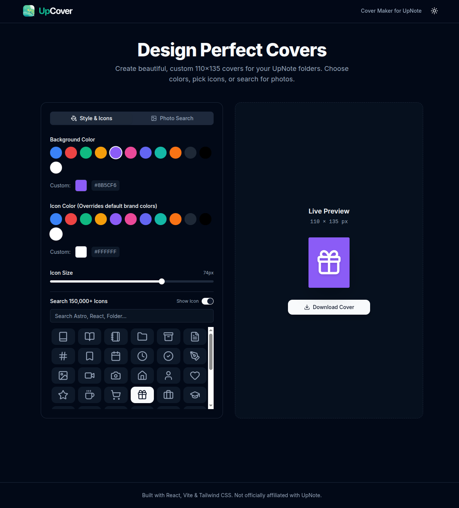

<div align="center">
  
</div>

<br />

UpCover is a lightweight, one-page web application designed to help you quickly generate beautiful, pixel-perfect (110x135) covers for your [UpNote](https://getupnote.com/) notebooks.



## ✨ Features

- **Custom Colors**: Choose from a handpicked preset color palette or select your own custom HEX color for both the background and the icon.
- **Iconify Search**: Access over **200,000+ icons** directly within the app. Search for anything from generic UI icons (Lucide, Phosphor) to specific tech logos (React, Astro, Vue).
- **Photo Backgrounds**: Seamlessly integrate with **Unsplash** and **Pexels** to search and apply stunning photography to your covers.
- **Pixel-Perfect Export**: Exports directly to a 110x135 PNG file, ensuring there is no compression or unwanted stretching when imported into UpNote.
- **Dark Mode**: Fully supports an elegant dark mode theme to protect your eyes during late-night organizational sessions.
- **Privacy First**: Your API keys for Unsplash and Pexels are stored safely in your browser's local storage and are never sent to external servers.

## 🚀 How to Run Locally

This project is built using **React**, **Vite**, **Tailwind CSS v4**, and **shadcn/ui**. It uses `pnpm` as the package manager.

### 1. Install Dependencies
```bash
pnpm install
```

### 2. Environment Variables (Optional)
Create a `.env` file in the root directory (you can copy from `.env.example` if it exists) and add your default API keys if you wish:
```env
VITE_UNSPLASH_ACCESS_KEY=your_unsplash_key
VITE_PEXELS_API_KEY=your_pexels_key
```
*Note: Users can also enter these keys directly through the app's settings UI.*

### 3. Start Development Server
```bash
pnpm run dev
```
The app will be available at `http://localhost:5173`.

### 4. Build for Production
```bash
pnpm run build
```
This will generate highly optimized static files in the `dist` directory.

## 🛠 Tech Stack

- **Framework**: React 19 + Vite
- **Styling**: Tailwind CSS v4
- **Components**: shadcn/ui (Radix Primitives)
- **Icons**: @iconify/react
- **Export**: html-to-image

## 💖 Support

If you find this tool helpful and want to support its development, you can buy me a coffee!

<a href="https://www.buymeacoffee.com/taylantatli" target="_blank">
  
</a>

## 📝 License

AGPL-3.0 License. Not officially affiliated with UpNote.
